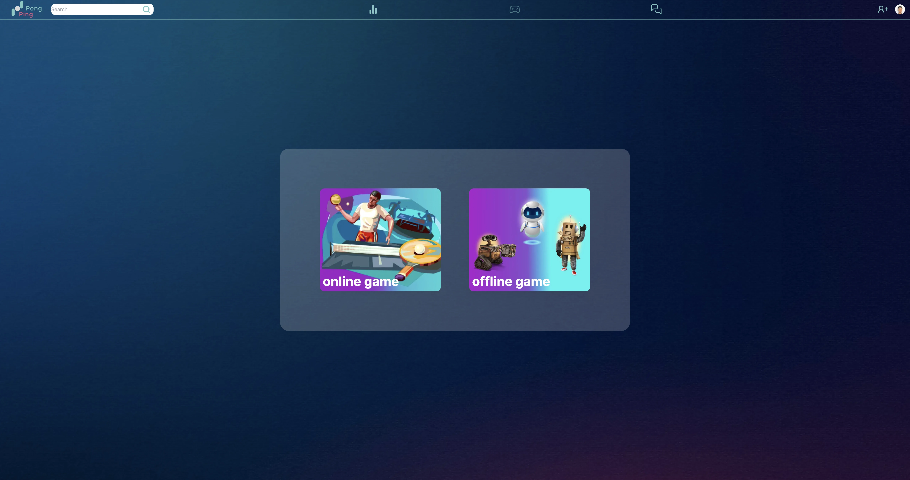
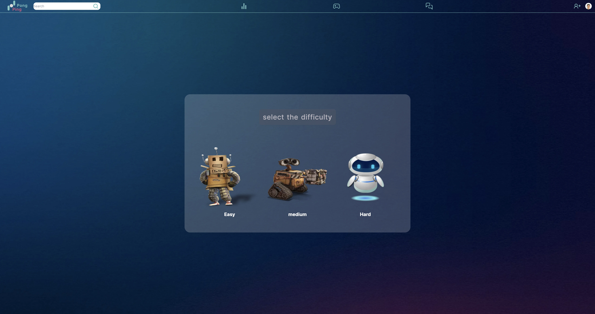
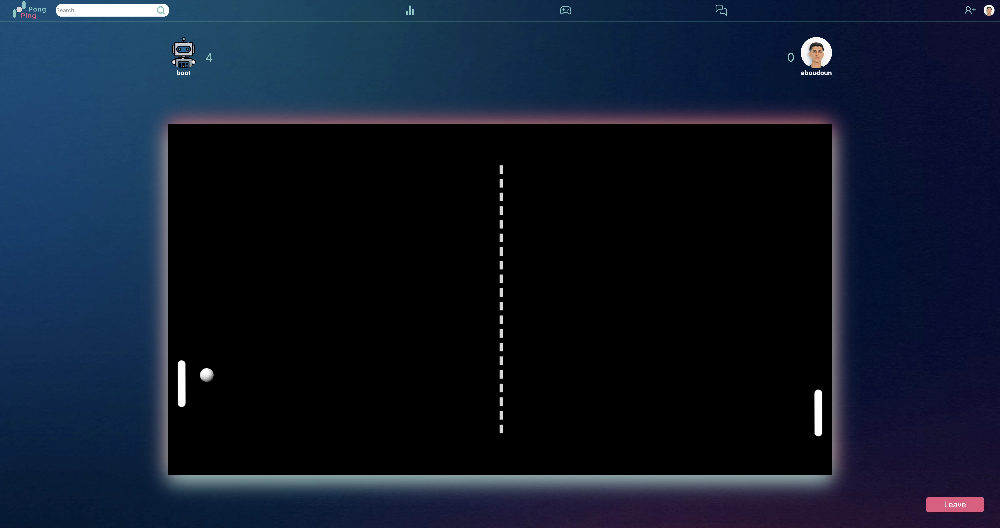
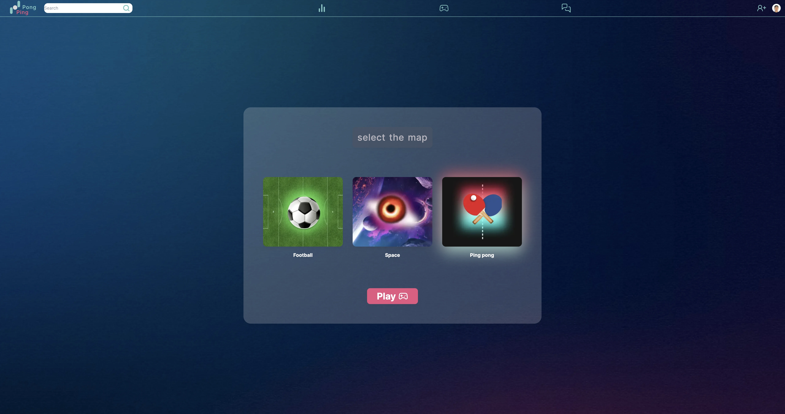
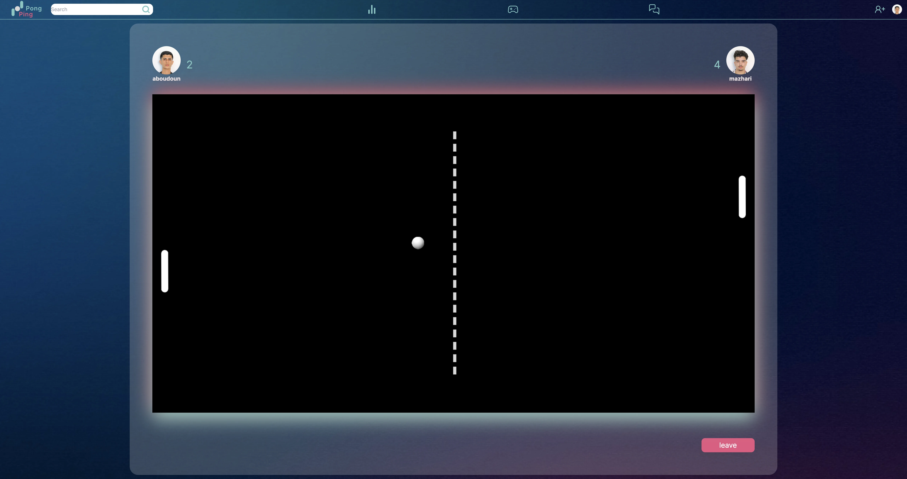
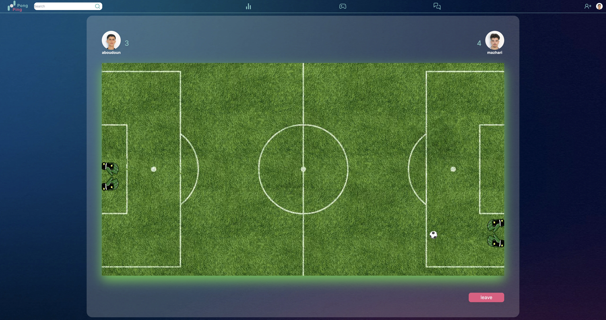
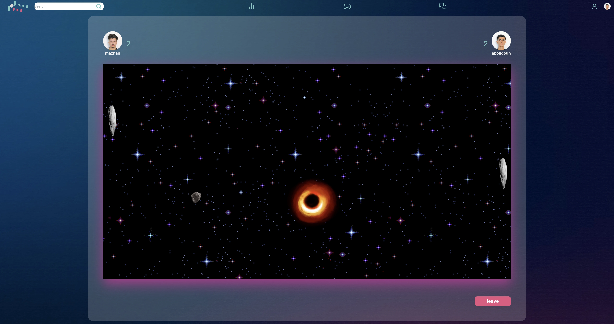
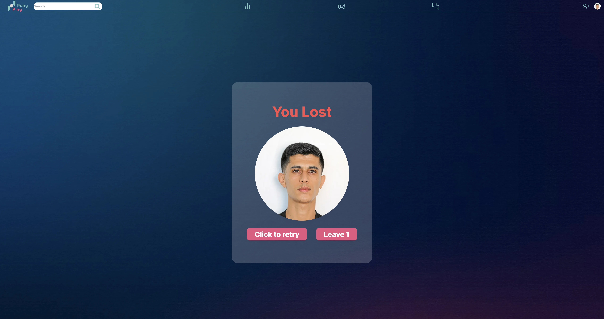
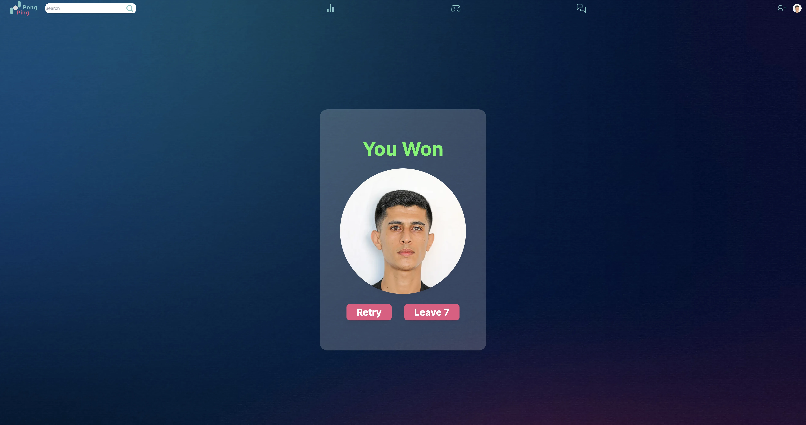
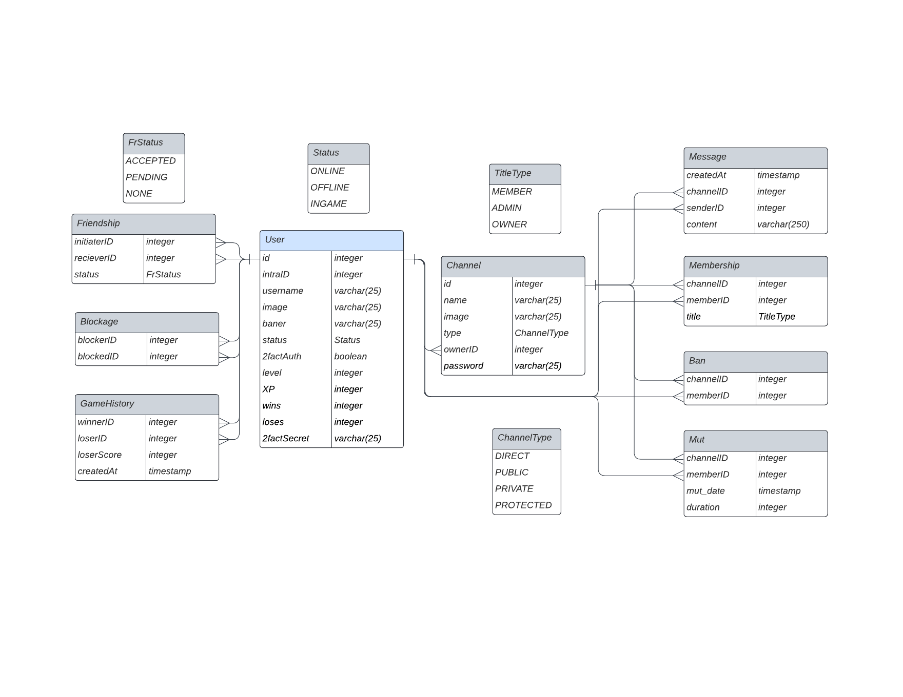

# ft_transcendence

[](https://1337.ma/en/)
[![result](https://img.shields.io/badge/Success-100/100-5cb85c?style=flat-square&logoWidth=12&logo=data:image/png;base64,iVBORw0KGgoAAAANSUhEUgAAADAAAAAwCAYAAABXAvmHAAAAAXNSR0IArs4c6QAAAylJREFUaEPtmDmLVEEUhb+LK+IG7qIibuCKYCYYOSoGomjimoggOgiKmYGhgYEMGqgYiJmIG4ig4IKGitsv8Ae4m7ocuWO108u8flWvu+030JXN9Kmqc+49devWM0b4sBHOn56Abmewl4FeBnIiIGk6cBtYCxwzs2vVU0ptIUkzgEfAmkBawFEzu1QRUVoBgfxjYHVdklzEETO77P8vpYAm5CtafgMH3U6lEyBpJuCRX5VzPH4BB0olIJB/AqyMrG4fSiNA0izAya+IJO+wp6UQkGCbam3vgL6uCyhgGxfxl7zZx64KCLbxAxvr+RryXS2jBT3/L/JdvcjaRX7YDEhaBJwB3gOnzexHQlXIhUqa69UDWJYLHgK8DZ7/VD+n5gxIWgfcB7yk+bgF7DaznwmbZUIlzQ6XVEqpbLDNsM2cpI2h65tcx+AmsKdVEYG81/nlCcHwyG/yapM1ZzADkvYBV4ExGcAbwF4z8+s7eUiaF2yzJGFypm1qMiCpH7gQ0di5wENm5o1U9ChI/k3w/Oe8jUzSd2BSHjD8fgU4bGbe0uYOSfND5BfngocA0eR9igu4C2xP2OAi0J8nQtKC0NukkH8dPJ8b+QpfFzABeABsSBBxHjieJaJg5KM8X8+xcoinhPLmZTR2DJjZiXpwwcgXIj9ooQqB8Hh+ltjOnjOzk1VruG38kvLLMHYUJl8jwP8It+RzIMW3Z4FTYc5DYGEsc+BV8PyXhDk10IZuVJITcBFeQWLH11DJRsVOaAf5hgxUWWEp4Haak0AoBeql0m/Yht4mZZFMAcFO/jnD/TwtddEcfFKdz9u76YNGkn8NcxFT8xaK/L2t5JtmoMpO6wE/nBMjSWbB2k4+SkCwUx9wDxhfUETyDRu7T/SbWNI2wFvrsbGLB9xLYLOZeaVq+4gWEDKxFbgDjItk0rHIV/ZPEhBE7AD8fZD1dqis/QLY0qnIFxYQROwErjcR0fHItyQgR8R/Ix9dhbL8LmlXyMTogPHexg9sdD8feZYyYclnoH4lSW6ngfC5b7+ZfWuVVMr8lgWkbNYJbE9AJ6KasmYvAynR6gR2xGfgD5kpEElZbxKNAAAAAElFTkSuQmCC)](https://projects.intra.42.fr/ft_transcendence/mine)

<!-- PROJECT LOGO -->
<br />
<div align="center">
    
</div>

<!-- TABLE OF CONTENTS -->
<ol>
  <li><a href="#about-the-project">About The Project</a>
    <ul>
      <li><a href="#built-with">Built With</a></li>
    </ul>
  </li>
  <li><a href="#getting-started">Getting Started</a>
    <ul>
      <li><a href="#env">Env</a></li>
      <li><a href="#prerequisites">Prerequisites</a></li>
      <li><a href="#installation">Installation</a></li>
    </ul>
  </li>
  <li><a href="#usage">Usage</a></li>
  <li><a href="#Screenshots">Screenshots</a></li>
  <li><a href="#Gameplay">Gameplay</a></li>
  <li><a href="#contributing">Contributing</a></li>
</ol>


<!-- ABOUT THE PROJECT -->

## About The Project


ft_transcendence is a dynamic web project focused on delivering real-time multiplayer Ping Pong games with user-friendly features, this website boasts secure authentication, a flexible chat system, and a customizable Pong game. Engage users in thrilling contests while maintaining robust security.

For detailed instructions, installation, and features, check the complete README. Enjoy the Pong contest!
/p>

### Built With

- [![Next][Next.js]][Next-url]
- [![React][React.js]][React-url]
- [![Tailwind][Tailwind]][Tailwind-url]
- [![Nest][Nest.js]][Nest-url]
- [![PostgreSQL][PostgreSQL]][Nest-url]

<p align="right">(<a href="#ft_transcendence">back to top</a>)</p>

## Getting Started

### Env

Before starting, you need to configure your environment:

1. Rename `.env_template` to `.env` and rename `./frontend/.env.local_template` to `./frontend/.env.local`.

2. Set the `CLIENT_ID` and `SECRET` variables for your 42 API `ID` and `SECRET`:
   
   - For 42 API:
     ```sh
     # 42 API
     CLIENT_ID=""
     SECRET=""
     ```
   - For Google OAuth:
     ```sh
     # Google API
     CLIENT_ID_GOOGLE=""
     SECRET_GOOGLE=""
     ```

   You can also customize other environment variables to suit your needs.

### Prerequisites

You only need `docker-compose` to run this project. If you don't have Docker installed, you can follow the installation guide [here](https://docs.docker.com/get-docker/).

### Installation

You can run this project with a single command:

```sh
docker-compose up --build
```

<p align="right">(<a href="#ft_transcendence">back to top</a>)</p>

## Usage

### `Authentication and Authorization`

Authentication in this project is handled through OAuth using the 42 or Google API. This means that users can log in to the website using their 42 or Google credentials. It's a secure and efficient way to verify a user's identity.

Authorization, on the other hand, is about controlling what users can and cannot do within the application. We've implemented a robust authorization system using JSON Web Tokens (JWT). These tokens are issued to authenticated users and contain information about their permissions. By checking the JWT, the application ensures that users have the appropriate access to different parts of the site.

For enhanced security, we've also implemented Two-Factor Authentication (2FA) using Google Authenticator. This is an optional but recommended security feature. It adds an extra layer of protection to user accounts. With 2FA enabled, users will need to provide a one-time code generated by Google Authenticator in addition to their password when logging in.

To enable the OAuth system, you need to set up the CLIENT_ID and SECRET variables in the .env file. These secrets must be kept confidential and should never be shared or exposed in public repositories. You can find more details on setting up the environment variables in [Env](#env).

### `Profile`

The user profile section serves as a comprehensive dashboard where users can access their individual statistics and achievements. It provides users with insights such as the number of wins and losses, their ladder level, and any in-game achievements they've unlocked. This feature offers a holistic view of a user's performance and progress within the application.

Users can see a list of their friends.
Users have the ability to add other users as friends, enabling them to challenge friends to games and engage in chat conversations.

If a user wishes to stop receiving messages or game invitations from a specific user, they have the option to block them. Blocking a user ensures that messages from the blocked user will not appear in any channel.

Within their profile settings, users can customize their displayed name and avatar, allowing for the creation of a unique online presence and self-expression within the community. Users also have the power to unblock other users, providing flexibility in managing their interactions and connections.

Users can explore the profiles of other users, providing a deeper understanding of their friends and gaming rivals.
By viewing other user profiles, users can access valuable information, including usernames, avatars, gaming statistics, achievements, and the current online status (online, offline, or in a game).
The profile section not only enhances the user experience but also serves as a central hub for social interactions, personalization, and connection within the gaming community. It empowers users to manage their friendships, customize their presence, and stay engaged in a meaningful way.

### `Chat`

The chat feature in the application is a dynamic communication tool. Users can create channels, which are essentially chat rooms. These channels can be configured as public, private, or protected by a password. Users can also send direct messages to each other. If you ever need to avoid specific users, you can block them, preventing their messages from appearing in your chat.

Chat channels are managed by the user who created them, known as the channel owner. The channel owner has control over various aspects, including setting or changing the channel's password and removing it. The owner can also designate other users as administrators who can assist in managing the channel, including the ability to kick, ban, or mute other users temporarily. However, administrators cannot take actions against the channel owner.

Additionally, the chat allows users to invite others to play a game of Pong directly from the chat interface. It's a convenient way to challenge other users to a match.

Users can also access other players' profiles through the chat interface, making it easy to get more information about their opponents or friends.

### `Game`

The primary purpose of this project is to offer users the ability to play Pong games directly on the website. We've developed a responsive and engaging gaming experience. Users can engage in live Pong matches with other players.

We've incorporated a matchmaking system to ensure that users can find opponents efficiently. This means users can join a queue and will be automatically matched with another player when available.

We've strived to stay true to the original Pong game from 1972, offering a faithful experience. In addition to the classic version, we've also added customization options. Users can choose from various power-ups or different maps to enhance their gaming experience. However, if they prefer, they can stick to the default version of the game without any additional features.

## Screenshots

```
Online Offline selection
```


```
Offline game
```





https://github.com/a-boudoun/ft_transcendence/assets/84498539/a1022cbf-4c37-4a4f-aebd-4ffbf39bc473


```
Online game maps
```


```
Default game
```


```
Football game
```


```
Space game
```


```
Lost game
```


```
Won game
```


## Gameplay

```
Gameplay
```
https://github.com/a-boudoun/ft_transcendence/assets/84498539/5d9f64b3-b639-4193-bf41-41ce3ab92b50


### `Database`


The application relies on a PostgreSQL database to store and manage data. This database ensures the consistency and reliability of information throughout the application. It stores essential data, including user profiles, game statistics, chat history, and more.

We've designed the database to support the various features of the application, ensuring that data is efficiently organized and accessible when needed.

These elements collectively form the foundation of this project, providing a feature-rich and engaging experience for users. For more specific details on configuring environment variables and setting up the project, please refer to the sections below.

<p align="right">(<a href="#ft_transcendence">back to top</a>)</p>

<!-- CONTRIBUTING -->

## Contributing

If you have a suggestion that would make this better, please fork the repo and create a pull request. You can also simply open an issue with the tag "enhancement".
Don't forget to give the project a star! Thanks again!

1. Fork the Project
2. Create your Feature Branch (`git checkout -b feature/AmazingFeature`)
3. Commit your Changes (`git commit -m 'Add some AmazingFeature'`)
4. Push to the Branch (`git push origin feature/AmazingFeature`)
5. Open a Pull Request

<p align="right">(<a href="#ft_transcendence">back to top</a>)</p>

<!-- MARKDOWN LINKS & IMAGES -->

[Next.js]: https://img.shields.io/badge/next.js-000000?style=for-the-badge&logo=nextdotjs&logoColor=white
[Next-url]: https://nextjs.org/
[React.js]: https://img.shields.io/badge/React-blue?style=for-the-badge&logo=react&logoColor=61DAFB
[React-url]: https://reactjs.org/
[Nest.js]: https://img.shields.io/badge/Nest.js-red?style=for-the-badge&logo=nestjs
[Nest-url]: https://nestjs.com/
[Tailwind]: https://img.shields.io/badge/TailwindCSS-38B2AC?style=for-the-badge&logo=tailwind-css&logoColor=white
[Tailwind-url]: https://tailwindcss.com/
[PostgreSQL]: https://img.shields.io/badge/PostgreSQL-336791?style=for-the-badge&logo=postgresql&logoColor=white
